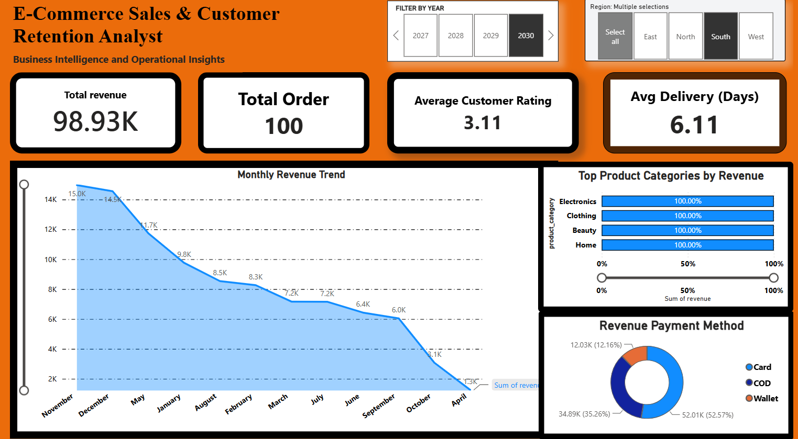

# E-Commerce Sales & Customer Retention Analytics Dashboard

## 📊 Project Overview
This project focuses on analyzing e-commerce transactional data to uncover insights regarding sales performance, customer retention patterns, and operational efficiency. The goal is to translate raw data into actionable business insights that help optimize marketing strategy, investment planning, and customer retention metrics.

## 🔗 Live Interactive Dashboard
👉 **## 🔗 Interactive Dashboard
👉 **[Download & View PBIX File](E-commerce_sales_and_analytics_5000.pbix)** 
*(Note: Please download the `.pbix` file from this repository to interact with the full dashboard locally in Power BI Desktop.)***
---

## 📸 Dashboard Preview

---

## 🎯 Key Metrics & Business Insights
*   **Total Revenue:** Generated **$98.93K** in revenue across targeted categories.
*   **Order Volume:** Successfully processed **100 orders** with an average customer rating of **3.11**.
*   **Operational Efficiency:** Maintained an average delivery timeline of **6.11 days**.
*   **Customer Preferences:** Identified **Electronics** and **Clothing** as top-performing product categories contributing to maximum revenue.
*   **Payment Logistics:** **Card payments** lead as the primary transaction method (52.57%), followed by **COD** (35.26%) and **Wallet** (12.16%).

## 🛠️ Technical Stack & Tools Used
*   **Data Visualization & BI:** Power BI Desktop (Dynamic KPI Cards, Line charts for Monthly Revenue Trends, Pie charts).
*   **Data Extraction & Transformation:** Advanced SQL Server (SSMS) queries, Joins, and data cleansing techniques.
*   **Analytical Formulas:** Implemented complex DAX measures for dynamic time-series analysis and regional segmentation.
